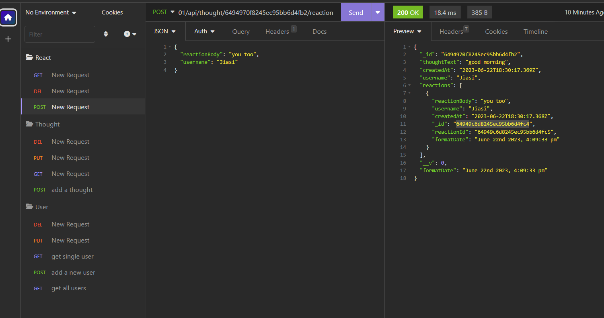

# 18 NoSQL: Social Network API

## Description

In this challenge, I need to build an API for a social network web application where users can share their thoughts, react to friends’ thoughts, and create a friend list. 

By using this application, I am able to successfully create, update, and delete users and thoughts in my database, and also create and delete reactions to thoughts and add and remove friends to a user’s friend list.

## Screenshots

## Links

* A walkthrough video: 
https://drive.google.com/file/d/1GY2DR954mqyu6iv1dIoN99D7EBysvf0B/view?usp=sharing

* The URL of the GitHub repository:
https://github.com/Jiasisi/Social-Network-API-NoSQL-

